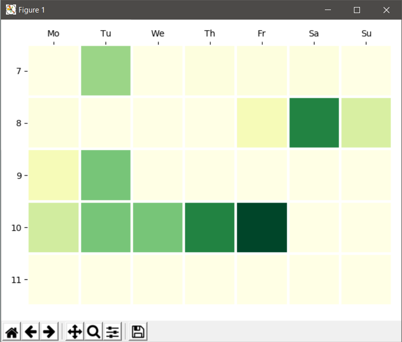

# contributist

This repository provides the code for visualizing your schedule in todoist as a contribution chart.

Tasks are weighted by specific labels.
I personally use the labels `@t5`, `@t30`, and `@t60` to indicate to myself whether I think that a task takes about 5 minutes, about 30 minutes or 60 minutes or longer.

The app calculates the sum of the weights for all tasks per day in a given timespan (default next 4 weeks).

This is how the result looks like:



As you can see, my Friday in calendar week 10 is pretty crowded.

## Setup

First, install dependencies in a virtual environment using [pipenv](https://github.com/pypa/pipenv):
```
pipenv install
```

Then create a json file with your API token (find your token the the bottom of this page: https://todoist.com/prefs/integrations) and all respective weights as explained in the introduction:

```json
{
    "token": "YOURTOKEN",
    "weight_tags": {
        "t5": 1,
        "t30": 6,
        "t60": 12
    },
    "default_weight": 1
}
```

## Execute

To display your schedule, execute:

```
pipenv run python -m contributist --config config.json --days 28
```

The `--days` argument is optional.
